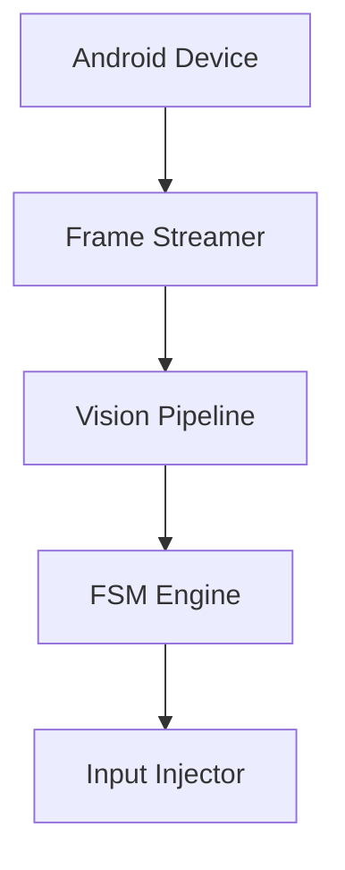

# 🤖 VisionBot-SDK: Real-Time Mobile Automation Framework

VisionBot-SDK is a lightweight Python framework for building high-speed Android automation tools, mobile testing systems, and computer-vision-driven agents.

Unlike traditional automation frameworks that rely on accessibility layers and high-overhead command pipelines, VisionBot continuously streams device frames, injects low-latency inputs, and provides a built-in state machine architecture for reliable automation.

---

## 🎥 Demo


> * Live Android screen streaming
> * State transitions
> * Automatic actions
> * VisionBot Dashboard

---

## ⚖️ Why VisionBot?

| Feature                        | VisionBot | Appium                    |
| ------------------------------ | --------- | ------------------------- |
| Continuous Frame Streaming     | ✅         | Requires Additional Setup |
| Low-Latency Input Pipeline     | ✅         | Higher Overhead           |
| Resolution-Independent Actions | ✅         | Manual                    |
| Built-in FSM Framework         | ✅         | User Implemented          |
| Lightweight Runtime            | ✅         | Heavier Stack             |
| Computer Vision First          | ✅         | External Integration      |

---

## 🏗️ Architecture



---

## 🚀 Key Advantages

### ⚡ Ultra-Low Latency Input

Directly injects taps and swipes through Android's Monkey socket, eliminating the overhead of repeatedly invoking shell commands.

### 📸 Continuous Frame Streaming

Frames are captured asynchronously and stored in a thread-safe buffer, ensuring computer vision pipelines never block on screenshot acquisition.

### 📐 Resolution-Independent Automation

Coordinates can be specified using normalized values between `0.0` and `1.0`.

The SDK automatically scales actions to match the target device resolution.

### 🧠 Event-Driven State Machines

Replace fragile loops and excessive `time.sleep()` calls with modular state-based automation workflows.

### 🖥️ Visual Dashboard

An optional dashboard module provides:

* Live viewport rendering
* State monitoring
* Performance metrics
* Action telemetry

---

## 🎯 Use Cases

VisionBot can be used for:

* Android UI Testing
* Mobile QA Automation
* Computer Vision Agents
* Accessibility Tools
* Workflow Automation
* Data Entry Automation
* Emulator Farm Management
* Mobile Game Automation

---

## 📦 Installation

### Requirements

* Python 3.8+
* ADB installed and available in PATH
* Android device or emulator

Verify device connectivity:

```bash
adb devices
```

Install VisionBot:

```bash
pip install visionbot-sdk
```

---

## ⚡ Quick Start

Connect to a device and stream frames in a few lines of code:

```python
from visionbot import AndroidDevice

device = AndroidDevice(capture_fps=15)

while True:
    frame = device.get_frame()

    if frame is not None:
        print("Frame received:", frame.shape)
        break
```

---

## 🌀 State Machine Example

VisionBot includes a built-in finite state machine architecture for creating reliable automation workflows.

```python
from visionbot import State, StateMachine, AndroidDevice


class StateLaunch(State):
    def on_enter(self, machine):
        print("Starting automation...")

    def execute(self, machine):
        return StateFinished


class StateFinished(State):
    def on_enter(self, machine):
        print("Automation complete.")
        machine.stop()


device = AndroidDevice()

fsm = StateMachine(device)

fsm.register(StateLaunch())
fsm.register(StateFinished())

fsm.start(StateLaunch)

fsm.run(tick_rate_seconds=0.05)
```

---

## 📂 Example Projects

### Calculator Test

Automated Android calculator validation using FSM-driven workflows.

```bash
python examples/calculator_test.py
```

### Encounter Bot

FSM-based visual automation example.

```bash
python examples/encounter_bot.py
```

### Dashboard Demo

Visual monitoring and telemetry dashboard.

```bash
python examples/encounter_bot_gui.py
```

---

## 📊 Benchmark Goals

| Metric                    | Target    |
| ------------------------- | --------- |
| Input Latency             | <1 ms     |
| Streaming FPS             | 15–30 FPS |
| Coordinate Scaling        | Automatic |
| State Transition Overhead | Minimal   |

---

## 🛣️ Roadmap

* [x] Continuous Frame Streaming
* [x] Resolution-Independent Input
* [x] FSM Framework
* [x] Visual Dashboard
* [ ] OCR Utilities
* [ ] Multi-Device Controller
* [ ] H.264 Streaming Backend
* [ ] Distributed Emulator Support
* [ ] Plugin Architecture

---

## 🤝 Contributing

Contributions, bug reports, and feature requests are welcome.

If you'd like to improve VisionBot or build integrations on top of it, feel free to open an issue or submit a pull request.

---

## 📄 License

Released under the MIT License.